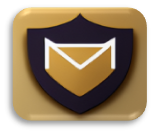

<!-- PROJECT LOGO -->
 

    

  <h3 align="center">laviMailServer</h3>

  

    A free, open source, secured email server
     
    <a href="https://github.com/othneildrew/Best-README-Template"><strong>Explore the docs »</strong></a>
     
     
    <a href="https://github.com/othneildrew/Best-README-Template">View Demo</a>
    ·
    <a href="https://github.com/othneildrew/Best-README-Template/issues">Report Bug</a>
    ·
    <a href="https://github.com/othneildrew/Best-README-Template/issues">Request Feature</a>
  

- It blocks emails that contain phishing, spoofing, and macro attacks. In addition, the files attached to the email are scanned in order to find malicious programs.
